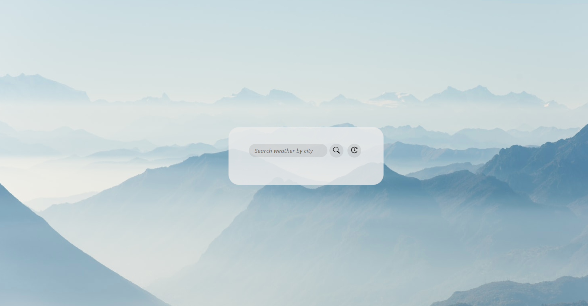
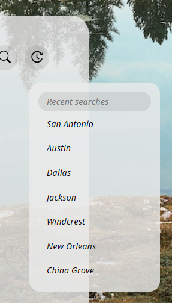

# Zach's Weather App

#### By Zach Hanson 

#### Purpose
All your weather in one place. See the current weather conditions as well as the 5-day forecast for your area. Want to know the weather from a different location? simply search for different a city. Your recent searches are saved in local storage for you to come back to. 

## Usage

1. Open the Weather App in any browser
2. Search weather by city name
3. Weather App displays current weather as well as 5-day forecast
4. Background image changes everytime the page is refreshed

## Technologies Used

HTML, 
CSS,
JavaScript,
Bootstrap,
React Icons (VSC Extension),
Google Fonts,
OpenWeathermap.org,
unsplash.com

## Credits

Special Thanks to UTSA Tutors Andrew Mason and Alistair Rowden for helping with this project

## website
Check it out for yourself! https://zachitp.github.io/Zach-s-Weather-App/

## License
MIT Copyright (c) Zach Hanson

Permission is hereby granted, free of charge, to any person obtaining a copy of this software and associated documentation files (the "Software"), to deal in the Software without restriction, including without limitation the rights to use, copy, modify, merge, publish, distribute, sublicense, and/or sell copies of the Software, and to permit persons to whom the Software is furnished to do so, subject to the following conditions:

The above copyright notice and this permission notice shall be included in all copies or substantial portions of the Software.

THE SOFTWARE IS PROVIDED "AS IS", WITHOUT WARRANTY OF ANY KIND, EXPRESS OR IMPLIED, INCLUDING BUT NOT LIMITED TO THE WARRANTIES OF MERCHANTABILITY, FITNESS FOR A PARTICULAR PURPOSE AND NONINFRINGEMENT. IN NO EVENT SHALL THE AUTHORS OR COPYRIGHT HOLDERS BE LIABLE FOR ANY CLAIM, DAMAGES OR OTHER LIABILITY, WHETHER IN AN ACTION OF CONTRACT, TORT OR OTHERWISE, ARISING FROM, OUT OF OR IN CONNECTION WITH THE SOFTWARE OR THE USE OR OTHER DEALINGS IN THE SOFTWARE.